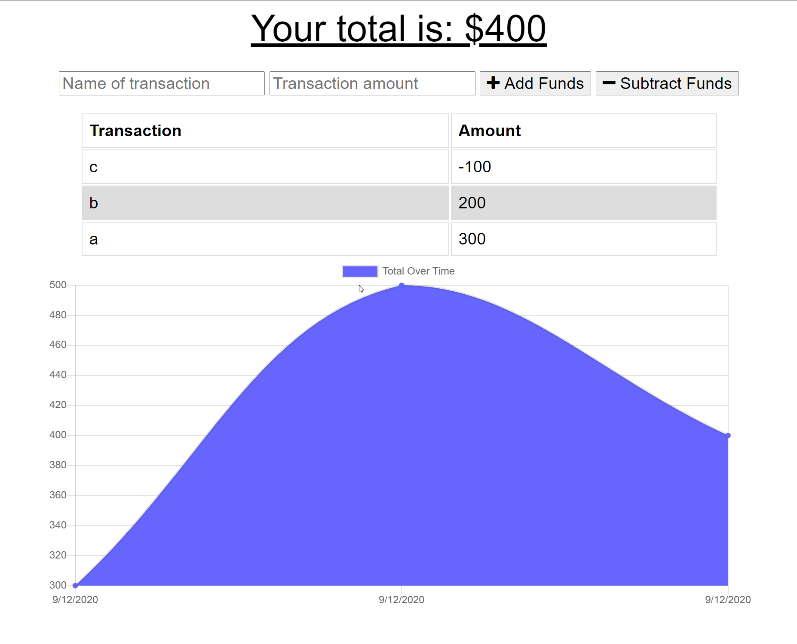

# budgetTracker

## Description 
  This is a Budget Tracker is a PWA (Progressive Web App) that allows the user to enter deposits and expenses in a budget on or offline.  If offline, the entries are stored and once back online syncs up with the database.  This full-stack app that uses HTML, CSS, JavaScript, Express, MongoDb/Mongoose, indexDB, ChartJS, and Web Manifiest and Service Workers for offline use.

  ## Table of Contents
  [1.  Installation](##Installation) 

  [2.  Instructions](##Instructions)

  [3.  App](##App)
  
  [4.  Questions](##Questions)

## Installation
  This needs requires the use of the following packages:

  [Express](https://www.npmjs.com/package/express)

  [Mongoose](https://www.npmjs.com/package/mongoose)

## Instructions

  1.    Make sure node.js is installed.
  2.    Run npm init.  This will install the packages in the package.json file (Express, Mongoose, and Morgan)
  3.    Start your server using `node server`.  If you are using the PWA, please have that installed first prior to going offline.  Any entries made will be synced up after going back online.
  

## App 

  

## Questions

  [Github Repository](https://github.com/kurt-austin/budgetTracker)

  [Heroku Repository](https://git.heroku.com/pacific-cove-73988.git)

  [Budget Tracker Deployed App](https://pacific-cove-73988.herokuapp.com/)

  [Contact](kurt.austin@gmail.com)
